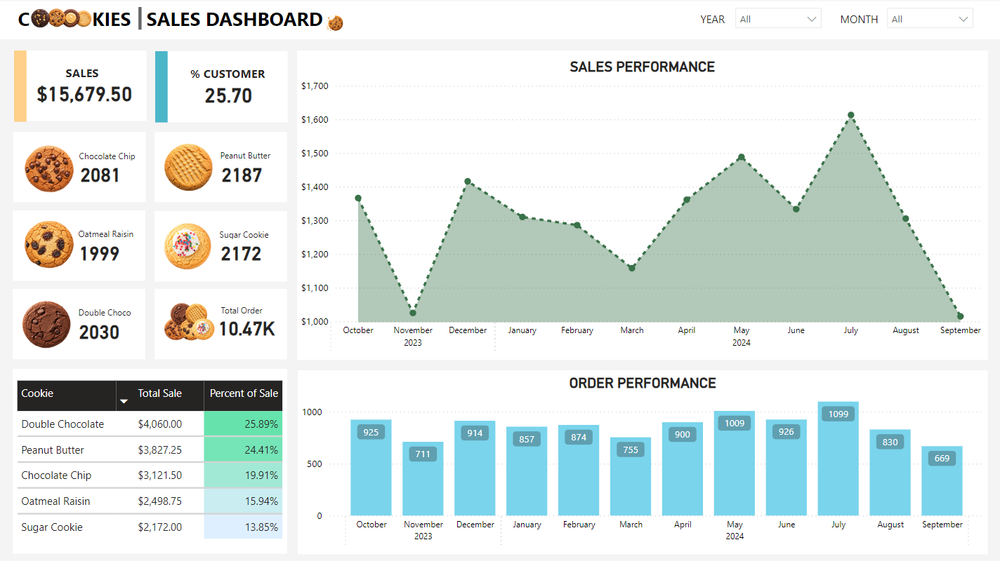
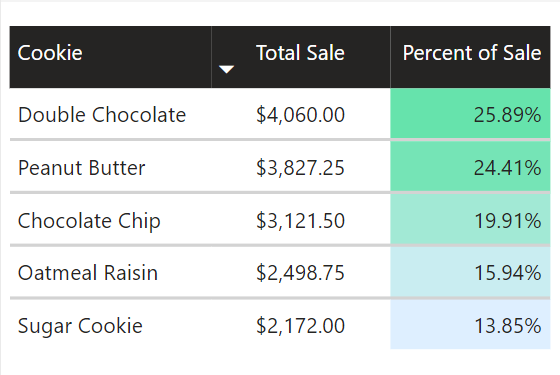
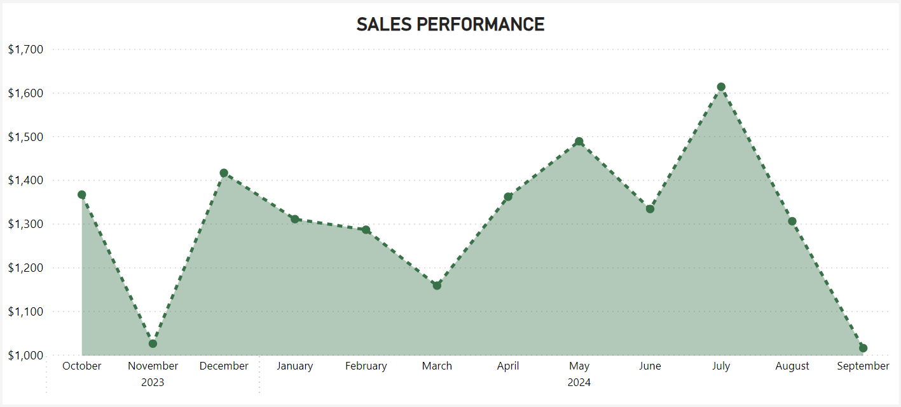

# Cookies Business Database Project Overview

## 📖 Project Overview

This End-to-End project show a cookies business by generating data for customers, orders, and cookies sold. The goal is to create a structured relational database for a bakery that tracks its sales performance and customer behavior. This project aims to showcase my skills and tools used and provide insightful data analysis like sales trends, repeat customer behavior, and forecasts based on historical data.

## 📈 Dashboard
 

You can check the full dashboard: [PowerBI_Cookies](https://github.com/Aldosee/SQL-Cookie-Analysis/blob/main/assets/Cookies_Dashboard2.png)


### 📊 Database Setup
 The following SQL queries were used to build and populate a fictional Cookies Business Database consisting of four main tables: Cookies, Customers, Orders, and Order_Details. 

#### **Schema and Data:** ***You can check the creation and importation of the data to the Database Engine (SQL Server Management Studio)*** [Click here](https://github.com/Aldosee/SQL-Cookie-Analysis/tree/main/data_import)

#### **1. Customers Table**
 - customer_id (Primary Key)
 - name
 - email
 - address

 #### **2. Orders Table**
 - order_id (Primary Key)
 - customer_id (Foreign Key references Customers)
 - order_date

#### **3. Order Details Table**
 - order_id (Foreign Key references Orders)
 - cookie_name
 - quantity
 - total_price

#### **4. Cookies Table**
 - cookie_id (Primary Key)
 - name
 - description
 - price

**SQL Queries for Data Insertion:** ***A Python script was used to generate 1,000 fictional customers, orders, and corresponding order details. Used Chatgpt to generate the python script.***

 ## Data Cleaning

 - **Handling Missing Values:** Ensuring there are no NULL values in critical fields (e.g., customer_id, order_id).
 - **Standardizing Data Formats:** Ensuring dates are in the correct format (ISO format).
 - **Removing Duplicates:** Using DISTINCT to avoid duplicate records in the analysis.

 ## Data Manipulation

 - **Data Transformation:** Using functions like SUM, COUNT, ROUND, and aggregating data to calculate totals and averages.
 - **Conditional Logic:** Utilizing CASE statements to categorize data (e.g., determining month names).
 - **Joining Tables:** Using JOIN operations to combine data from different tables (e.g., linking Orders and Order_Details).

  ## Query Optimization (Subqueries and CTEs)
**Subqueries** used for aggregating data and filtering results based on specific criteria and **Common Table Expressions (CTEs)** to simplify complex queries and organize logic making SQL code more readable and maintainable.
 


 ## 💭 SQL Queries and Data Visualization
### 1. Which cookie generates the highest total revenue and highest number of orders?
```
--Sale
SELECT 
      c.name, SUM(od.total_price) AS total_sale
FROM 
      Order_Details od
LEFT JOIN 
      Cookies c
      ON od.cookie_id = c.cookie_id
GROUP BY 
      c.name
ORDER BY 
      total_sale DESC 
```
### RESULT:
|        name        | total_sale |
|--------------------|------------|
|  Double Chocolate   |   4060.00  |
|   Peanut Butter     |   3827.25  |
|   Chocolate Chip    |   3121.50  |
|   Oatmeal Raisin    |   2498.75  |
|     Sugar Cookie    |   2172.00  |

```
--Order
SELECT 
      c.name, SUM(od.quantity) AS highest_order_cookie 
FROM 
      Order_Details od
LEFT JOIN 
      Cookies c
      ON od.cookie_id = c.cookie_id
GROUP BY 
      c.name
ORDER BY 
      highest_order_cookie DESC
```
### RESULT:
|        name        | highest_order_cookie |
|--------------------|----------------------|
|   Peanut Butter     |         2187         |
|     Sugar Cookie    |         2172         |
|   Chocolate Chip    |         2081         |
|   Double Chocolate  |         2030         |
|   Oatmeal Raisin   |         1999         |


### VISUALIZATION:


***Analyze cookie product sales to determine top cookie sale and highest order***

### 2. What is the trend in sales over the last 12 months?
```
SELECT 
      SUM(od.quantity) AS total_order_for_the_day, 
      o.order_date, SUM(od.total_price) as total_sale
FROM 
      Order_Details od
LEFT JOIN 
      Orders o
      ON od.order_id = o.order_id
GROUP BY 
      o.order_date
ORDER BY 
      o.order_date ASC
```
### RESULT:
| total_order_for_the_day | order_date  | total_sale |
|-------------------------|-------------|------------|
| 7                       | 2023-10-01  | 10.50      |
| 12                      | 2023-10-03  | 15.25      |
| 36                      | 2023-10-04  | 57.00      |
| 20                      | 2023-10-06  | 20.00      |
| 17                      | 2023-10-07  | 21.00      |
| 57                      | 2023-10-08  | 86.25      |
| 38                      | 2023-10-11  | 70.50      |
| 9                       | 2023-10-12  | 31.50      |
| 21                      | 2023-10-15  | 31.50      |
| 107                     | 2023-10-16  | 140.50     |
| 6                       | 2023-10-17  | 7.50       |
| 163                     | 2023-10-19  | 244.50     |
| 46                      | 2023-10-20  | 60.50      |
| 60                      | 2023-10-21  | 105.25     |
| 28                      | 2023-10-22  | 33.50      |
| 23                      | 2023-10-23  | 41.50      |
| 107                     | 2023-10-25  | 158.00     |
| 26                      | 2023-10-26  | 62.00      |
| 39                      | 2023-10-28  | 46.25      |

### VISUALIZATION:

***Visualizes sales performance trends across the year helping to track growth or decline.***

#### 3. What percentage of customers are repeat buyers?
```
WITH repeat_order AS (
SELECT 
      customer_id, COUNT(*) AS repeat_orders 
FROM 
      Orders
GROUP BY 
      customer_id
      HAVING COUNT(*) > 1
)
SELECT 
    COUNT(repeat_orders) AS total_repeat_order, 
      (SELECT COUNT(customer_id) FROM Orders) AS total_orders,
      CAST(COUNT(repeat_orders) AS DECIMAL(10, 2)) / CAST((SELECT COUNT(customer_id) FROM Orders) AS DECIMAL(10, 2)) * 100 AS percent_of_repeat_orders
FROM 
    repeat_order;
```
### RESULT:
| total_repeat_order |total_orders| percent_of_repeat_orders |
|--------------------|-------------|------------|
| 257               | 1000        | 25.70      |


***Calculates the percentage of repeat customers, providing insight into customer loyalty and retention.***


#### 4. What is the month-over-month sales performance?
```
SELECT 
      YEAR(o.order_date) AS year_cookies, 
	  CASE 
		WHEN MONTH(o.order_date) = 1 THEN 'January'
		WHEN MONTH(o.order_date) = '2' THEN 'February'
		WHEN MONTH(o.order_date) = '3' THEN 'March'
		WHEN MONTH(o.order_date) = '4' THEN 'April'
		WHEN MONTH(o.order_date) = '5' THEN 'May'
		WHEN MONTH(o.order_date) = '6' THEN 'June'
		WHEN MONTH(o.order_date) = '7' THEN 'July'
		WHEN MONTH(o.order_date) = '8' THEN 'August'
		WHEN MONTH(o.order_date) = '9' THEN 'September'
		WHEN MONTH(o.order_date) = '10' THEN 'October'
		WHEN MONTH(o.order_date) = '11' THEN 'November'
		WHEN MONTH(o.order_date) = '12' THEN 'December'
		END AS month_cookies,
		SUM(od.total_price) as total_sale
FROM 
      Order_Details od
LEFT JOIN 
      Orders o
      ON od.order_id = o.order_id
GROUP BY 
      YEAR(o.order_date), MONTH(o.order_date)
ORDER BY 
      year_cookies DESC
```
### RESULT:

| year_cookies | month_cookies | total_sale |
|--------------|---------------|------------|
| 2024         | January       | 1310.25    |
| 2024         | February      | 1286.00    |
| 2024         | March         | 1158.00    |
| 2024         | April         | 1361.50    |
| 2024         | May           | 1488.50    |
| 2024         | June          | 1333.50    |
| 2024         | July          | 1613.25    |
| 2024         | August        | 1305.50    |
| 2024         | September     | 1015.00    |
| 2023         | October       | 1366.50    |
| 2023         | November      | 1025.25    |
| 2023         | December      | 1416.25    |

***Breaks down sales performance by month to help identify seasonality and sales trends.***

#### 5.1 Can we forecast which products will perform well in the future based on past performance? (9 months past performance in 2024 based on orders and sales)
```
--Order
WITH nine_month_performance AS (
SELECT c.name AS cookies, SUM(od.quantity) AS highest_order_cookie, YEAR(o.order_date) AS year_cookies,
		CASE 
		WHEN MONTH(o.order_date) = '1' THEN 'January'
		WHEN MONTH(o.order_date) = '2' THEN 'February'
		WHEN MONTH(o.order_date) = '3' THEN 'March'
		WHEN MONTH(o.order_date) = '4' THEN 'April'
		WHEN MONTH(o.order_date) = '5' THEN 'May'
		WHEN MONTH(o.order_date) = '6' THEN 'June'
		WHEN MONTH(o.order_date) = '7' THEN 'July'
		WHEN MONTH(o.order_date) = '8' THEN 'August'
		WHEN MONTH(o.order_date) = '9' THEN 'September'
		WHEN MONTH(o.order_date) = '10' THEN 'October'
		WHEN MONTH(o.order_date) = '11' THEN 'November'
		WHEN MONTH(o.order_date) = '12' THEN 'December'
		END AS month_cookies,
		SUM(od.total_price) as total_sale
FROM Order_Details od
LEFT JOIN Cookies c
ON od.cookie_id = c.cookie_id
LEFT JOIN Orders o
ON od.order_id = o.order_id
GROUP BY YEAR(o.order_date), MONTH(o.order_date), c.name
)

SELECT cookies, SUM(highest_order_cookie) AS total_order
FROM nine_month_performance
WHERE month_cookies IN ('January','February','March','April','May','June','July','August','September') AND year_cookies = 2024
GROUP BY cookies
ORDER BY total_order DESC;
```
### RESULT:
| cookies | total_order | 
|---------|-------------|
| Peanut Butter         | 1712 
| Sugar Cookie         | 1657    
| Chocolate Chip         | 1612         
| Double Chocolate         | 1504         
| Oatmeal Raisin | 1434 
```
--Sale
WITH nine_month_performance AS (
SELECT c.name AS cookies, SUM(od.quantity) AS highest_order_cookie, YEAR(o.order_date) AS year_cookies,
		CASE 
		WHEN MONTH(o.order_date) = '1' THEN 'January'
		WHEN MONTH(o.order_date) = '2' THEN 'February'
		WHEN MONTH(o.order_date) = '3' THEN 'March'
		WHEN MONTH(o.order_date) = '4' THEN 'April'
		WHEN MONTH(o.order_date) = '5' THEN 'May'
		WHEN MONTH(o.order_date) = '6' THEN 'June'
		WHEN MONTH(o.order_date) = '7' THEN 'July'
		WHEN MONTH(o.order_date) = '8' THEN 'August'
		WHEN MONTH(o.order_date) = '9' THEN 'September'
		WHEN MONTH(o.order_date) = '10' THEN 'October'
		WHEN MONTH(o.order_date) = '11' THEN 'November'
		WHEN MONTH(o.order_date) = '12' THEN 'December'
		END AS month_cookies,
		SUM(od.total_price) as total_sale
FROM Order_Details od
LEFT JOIN Cookies c
ON od.cookie_id = c.cookie_id
LEFT JOIN Orders o
ON od.order_id = o.order_id
GROUP BY YEAR(o.order_date), MONTH(o.order_date), c.name
)
SELECT cookies, SUM(total_sale) AS total_sale
FROM nine_month_performance
WHERE month_cookies IN ('January','February','March','April','May','June','July','August','September') AND year_cookies = 2024
GROUP BY cookies
ORDER BY total_sale DESC;
```
### RESULT:
| cookies | total_sale | 
|---------|-------------|
| Double Chocolate	|3008.00
|Peanut Butter	|2996.00
|Chocolate Chip	|2418.00
|Oatmeal Raisin	|1792.50
|Sugar Cookie	|1657.00


#### 5.2 Using the moving average method for a 4-quarter 2024. (Estimated sale in Oct, Nov, Dec).What are the expected sales for the next quarter based on historical trends? 
```
WITH sale_per_month AS (
SELECT YEAR(o.order_date) AS year_cookies, 
		CASE 
		WHEN MONTH(o.order_date) = '1' THEN 'January'
		WHEN MONTH(o.order_date) = '2' THEN 'February'
		WHEN MONTH(o.order_date) = '3' THEN 'March'
		WHEN MONTH(o.order_date) = '4' THEN 'April'
		WHEN MONTH(o.order_date) = '5' THEN 'May'
		WHEN MONTH(o.order_date) = '6' THEN 'June'
		WHEN MONTH(o.order_date) = '7' THEN 'July'
		WHEN MONTH(o.order_date) = '8' THEN 'August'
		WHEN MONTH(o.order_date) = '9' THEN 'September'
		WHEN MONTH(o.order_date) = '10' THEN 'October'
		WHEN MONTH(o.order_date) = '11' THEN 'November'
		WHEN MONTH(o.order_date) = '12' THEN 'December'
		END AS month_cookies,
		SUM(od.total_price) as total_sale
FROM Order_Details od
LEFT JOIN Orders o
ON od.order_id = o.order_id
GROUP BY YEAR(o.order_date), MONTH(o.order_date)

)
SELECT SUM(total_sale) AS first_qtr_sale,
			(SELECT SUM(total_sale)
			FROM sale_per_month
			WHERE month_cookies IN ('April','May','June') AND year_cookies = 2024) AS second_qtr_sale,
			(SELECT SUM(total_sale)
			FROM sale_per_month
			WHERE month_cookies IN ('July','August','September') AND year_cookies = 2024) AS third_qtr_sale,
			(SELECT ROUND(SUM(total_price)/ 3, 2)
			FROM Order_Details od
			LEFT JOIN Orders o
			ON od.order_id = o.order_id
			WHERE YEAR(o.order_date) = '2024') AS avg_fourth_qtr_sale
FROM sale_per_month
WHERE month_cookies IN ('January','February','March') AND year_cookies = 2024
```
### RESULT:
| first_qtr_sale | second_qtr_sale | third_qtr_sale | avg_fourth_qtr_sale |
|----------------|-----------------|----------------|---------------------|
| 3754.25        | 4183.50         | 3933.75        | 3957.17             |

***The moving average for a period of four quarters is typically calculated by taking the average of the sales from the last three quarters. In this case, since we only have three quarters of data for 2024. Formula (Total Sale(Q1,Q2,Q3/3 Quarters)) = Moving Average. Thus 3957.17, we can use this as an estimated sales figure for each month (October, November, December) in the fourth quarter of 2024.***

## 🛠️ Tools and Technologies

 - **SQL Server Management Studio (SSMS):** For creating the relational database, and inserting records.
- **SQL:** Run queries and data manipulation.
 - **Python (Faker Library):** To automate the generation of 1000 fictional customer, order, and order details records.
 - **CSV Files:** The data generated was saved in CSV format and then inserted into the SSMS database.
 - **Power BI:** Used for building an interactive dashboard to visualize sales trends and customer behavior.


## 🤺 Challenges
 - Resolving foreign key constraint issues during data insertion.
 - Handling and normalizing non-standard date formats.
 - Managing large data inserts and query performance.

## 📍Notes
This project demonstrates practical skills in data generation, querying, and analysis to simulate a real-world cookies business database. The 1000 fictional data entries offer an excellent base for advanced analysis providing valuable insights for business growth and optimization strategies.


